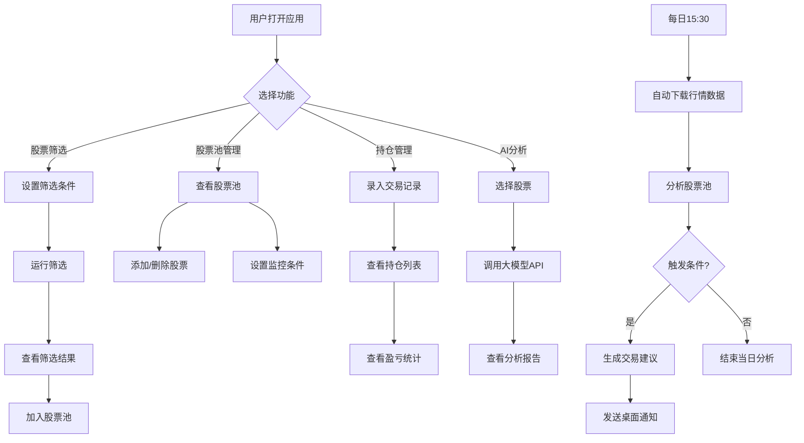

# 股票投资管理桌面应用 - 产品需求文档（PRD）

**版本号**：V1.0  
**文档日期**：2026-05-15  
**目标用户**：个人散户（Windows系统，每日使用<1小时）  
**技术栈**：Tauri 2.0 + React 18 + TypeScript + Vite + Ant Design + ECharts

---

## 1. 产品概述

### 1.1 项目概述

本项目是一款基于 **Tauri 2.0 正式版** 架构的**轻量化、非打扰式、完全本地**的个人投资管理工具，专注于中长线投资者的核心需求。现有主流股票软件普遍存在功能繁杂、广告多、启动慢、隐私性差等问题，且过度强调盘中实时盯盘，容易干扰有稳定工作的个人投资者的日常工作。本项目旨在解决这些痛点，打造一款真正为个人散户服务的桌面应用。

### 1.2 核心价值

- **高效筛选**：快速筛选符合条件的股票，建立个人股票池
- **智能提醒**：每日收盘后自动分析股票池，触发条件时给出交易建议
- **精准管理**：自动计算持仓盈亏和资产情况，无需手动统计
- **AI辅助**：对接大模型获取专业分析，辅助投资决策
- **隐私安全**：所有数据本地存储，不上传云端，保护投资隐私

### 1.3 项目范围

- **包含**：股票池管理、股票筛选、每日收盘后智能分析、持仓盈亏管理、大模型AI分析
- **不包含**：盘中实时行情推送、在线交易、社区交流、付费资讯

---

## 2. 核心功能

### 2.1 功能模块

1. **股票池管理页**：创建分组、添加删除股票、批量导入导出、列表展示与排序
2. **股票筛选页**：设置筛选条件、保存自定义条件、运行筛选、结果加入股票池
3. **智能分析与提醒页**：设置监控条件、查看每日交易建议报告、历史报告查询
4. **持仓与盈亏管理页**：录入交易记录、查看持仓列表、盈亏计算、历史记录筛选
5. **大模型AI分析页**：配置API密钥、生成分析报告、查看历史报告
6. **系统设置页**：启动密码、主题切换、数据备份恢复、快捷键配置

### 2.2 页面详情

| 页面名称 | 模块名称 | 功能描述 |
|---------|---------|---------|
| 股票池管理 | 分组管理 | 创建、编辑、删除股票池分组 |
| 股票池管理 | 股票列表 | 显示股票代码、名称、最新价、涨跌幅、成交量、监控状态 |
| 股票池管理 | 操作功能 | 手动添加/删除股票、批量导入导出、排序 |
| 股票筛选 | 条件设置 | 价格区间、涨跌幅区间、成交量区间、市盈率区间、换手率区间 |
| 股票筛选 | 条件管理 | 保存/加载自定义筛选条件 |
| 股票筛选 | 结果操作 | 一键将筛选结果加入指定股票池 |
| 智能分析 | 监控条件 | 为单只股票设置价格、涨跌幅、成交量监控条件 |
| 智能分析 | 每日报告 | 查看当日交易建议报告（股票名称、触发条件、当前价格、建议操作） |
| 智能分析 | 历史记录 | 按日期查询历史交易建议报告 |
| 持仓管理 | 交易录入 | 录入买入/卖出交易记录（代码、名称、数量、价格、日期） |
| 持仓管理 | 持仓列表 | 显示持仓数量、成本、最新价、浮动盈亏、收益率、持仓占比 |
| 持仓管理 | 资产概览 | 总持仓市值、总浮动盈亏、总资产、总收益率 |
| 持仓管理 | 历史记录 | 查看并筛选历史交易记录 |
| AI分析 | 密钥配置 | 配置豆包、文心一言、通义千问API密钥 |
| AI分析 | 报告生成 | 一键获取单只股票的AI分析报告 |
| AI分析 | 报告查看 | 查看历史AI分析报告 |
| 系统设置 | 安全设置 | 设置应用启动密码 |
| 系统设置 | 数据管理 | 手动备份和恢复SQLite数据库 |
| 系统设置 | 外观设置 | 深色/浅色主题切换 |

---

## 3. 核心流程

### 3.1 主要用户流程

**流程1：不定期筛选股票**
用户打开应用 → 进入股票筛选页 → 选择预设筛选条件 → 运行筛选 → 查看结果 → 将感兴趣的股票加入股票池

**流程2：每日收盘后智能分析与提醒**
每日15:30股市收盘 → Rust后端自动下载当日行情数据 → 分析股票池中的所有股票 → 检查监控条件 → 生成交易建议报告 → 发送桌面通知 → 用户收到通知后打开应用查看报告

**流程3：收盘后查看持仓和盈亏**
用户打开应用 → 进入持仓管理页 → 查看持仓列表 → 查看当日盈亏和总资产 → 查看资产变化趋势

**流程4：使用AI分析股票**
用户选择一只股票 → 点击"AI分析"按钮 → 系统调用大模型API → 生成分析报告 → 用户查看报告

### 3.2 核心流程图

---

## 4. 用户界面设计

### 4.1 设计理念

采用**"金融终端的克制美学"**——一种融合了瑞士国际主义排版、深色数据可视化传统和现代极简主义的设计方向。整体风格冷静、专业、值得信赖，没有多余的装饰，让数据本身成为视觉焦点。

**设计关键词**：克制、精准、专业、静谧、数据驱动

### 4.2 色彩系统

**主色调**：
- 背景色：`#0a0e1a`（深邃夜空蓝黑）
- 主表面色：`#111827`（炭灰色）
- 次表面色：`#1f2937`（深灰色）
- 边框色：`#374151`（中灰色）

**强调色**：
- 上涨/买入：`#10b981`（翡翠绿）
- 下跌/卖出：`#ef4444`（警示红）
- 中性/持有：`#6b7280`（灰蓝色）
- 主强调：`#3b82f6`（科技蓝）
- 次强调：`#8b5cf6`（紫罗兰）

**文字色**：
- 主文字：`#f9fafb`（近白色）
- 次文字：`#9ca3af`（浅灰色）
- 辅助文字：`#6b7280`（中灰色）

### 4.3 字体设计

- **Display字体**：`"Noto Serif SC"`（思源宋体）—— 用于大标题和关键数字，传达稳重、专业的金融气质
- **Body字体**：`"Noto Sans SC"`（思源黑体）—— 用于正文和数据表格，确保清晰易读
- **数字字体**：`"JetBrains Mono"` —— 用于价格、涨跌幅等数字，等宽字体确保对齐

### 4.4 布局风格

- **整体布局**：左侧固定导航栏（200px宽）+ 右侧主内容区
- **导航栏**：深色背景，图标+文字菜单项，选中状态高亮
- **内容区**：卡片式布局，数据表格为主，图表辅助
- **间距系统**：基于4px的网格系统，保持视觉节奏

### 4.5 动效设计

- **页面加载**：数据表格行 staggered fade-in（逐行淡入），延迟50ms
- **数字变化**：价格、涨跌幅数字变化时使用平滑过渡动画
- ** hover效果**：表格行hover时背景色渐变，卡片hover时轻微上浮+阴影
- **通知动画**：桌面通知从右下角滑入，带弹性效果
- **图表动画**：K线图和统计图表加载时带绘制动画

### 4.6 页面设计概述

| 页面名称 | 模块名称 | UI元素 |
|---------|---------|--------|
| 股票池管理 | 分组标签页 | 标签页切换动画，卡片式股票列表 |
| 股票池管理 | 股票表格 | 排序表头，涨跌幅颜色标识，操作按钮 |
| 股票筛选 | 条件面板 | 滑块输入，区间选择，保存按钮 |
| 股票筛选 | 结果表格 | 与股票池表格一致，多选框，批量操作 |
| 智能分析 | 监控条件 | 条件列表，开关控件，阈值输入 |
| 智能分析 | 报告卡片 | 卡片式报告，建议标签（买入/卖出/持有） |
| 持仓管理 | 资产概览 | 大数字展示，趋势指示器 |
| 持仓管理 | 持仓表格 | 盈亏颜色标识，持仓占比进度条 |
| AI分析 | 报告展示 | Markdown渲染，分节展示 |
| 系统设置 | 设置面板 | 表单输入，开关切换，按钮 |

### 4.7 响应式设计

- **桌面优先**：主要面向Windows桌面用户
- **分辨率适配**：支持1080P、2K、4K分辨率
- **窗口缩放**：最小窗口尺寸 1024x768，内容自适应

---

## 5. 非功能需求

### 5.1 性能需求

- 应用冷启动时间：≤1.5秒
- 筛选1000只股票的时间：≤3秒
- 每日收盘后数据更新+分析时间：≤20秒
- 后台静默运行内存占用：≤40MB
- 连续运行72小时无明显卡顿和内存泄漏

### 5.2 体验需求

- 界面简洁清爽，无任何广告
- 核心操作流程不超过3步
- 点击按钮响应时间：≤200毫秒
- 支持窗口最小化到系统托盘，后台静默运行
- **非打扰式设计**：除每日收盘后一次通知外，不推送任何其他消息

### 5.3 安全与隐私需求

- 所有用户数据仅存储在本地SQLite数据库，不上传任何云端
- 支持设置应用启动密码，保护隐私
- 大模型API密钥使用AES-256-GCM加密存储
- 严格的前后端隔离，前端无法直接访问文件系统和数据库
- 不收集任何用户个人信息和投资数据

### 5.4 兼容性需求

- 支持Windows 10 1809及以上版本（自带Edge WebView2）
- 支持1080P、2K、4K不同分辨率的显示器
- 单文件部署，无需安装，双击即可运行

---

## 6. 数据需求

### 6.1 数据实体

- **股票池**：id, name, description, created_at
- **股票**：id, code, name, pool_id, latest_price, change_percent, volume, monitored, updated_at
- **监控条件**：id, stock_id, condition_type, threshold, action, created_at
- **交易记录**：id, stock_code, stock_name, type, quantity, price, amount, transaction_date, created_at
- **持仓**：id, stock_code, stock_name, quantity, cost_price, latest_price, floating_profit, profit_rate, updated_at
- **交易建议**：id, stock_code, stock_name, condition, current_price, advice, created_at
- **AI分析报告**：id, stock_code, stock_name, content, created_at
- **系统配置**：id, key, value（加密存储）, created_at, updated_at

### 6.2 数据流

1. **行情数据**：每日15:30从外部API获取 → 存储到SQLite → 更新股票价格和持仓盈亏
2. **用户数据**：前端操作 → IPC调用 → Rust后端处理 → 存储到SQLite
3. **AI分析报告**：用户请求 → 调用大模型API → 存储到SQLite → 前端展示

---

## 7. 附录

### 7.1 术语定义

- **股票池**：用户自定义的股票分组，用于跟踪和管理感兴趣的股票
- **监控条件**：用户为股票设置的触发提醒的条件
- **交易建议**：系统根据监控条件生成的买入/卖出/持有建议
- **浮动盈亏**：持仓股票当前市值与持仓成本之间的差额
- **IPC**：进程间通信，前端与后端交互的方式

### 7.2 参考文档

- [用户需求说明书](d:\sf-project\smps/需求说明书.md)
