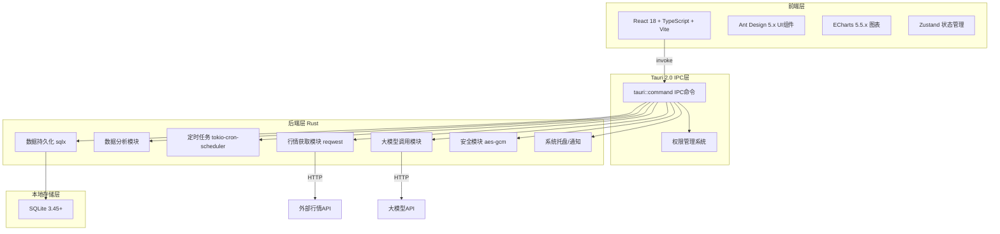
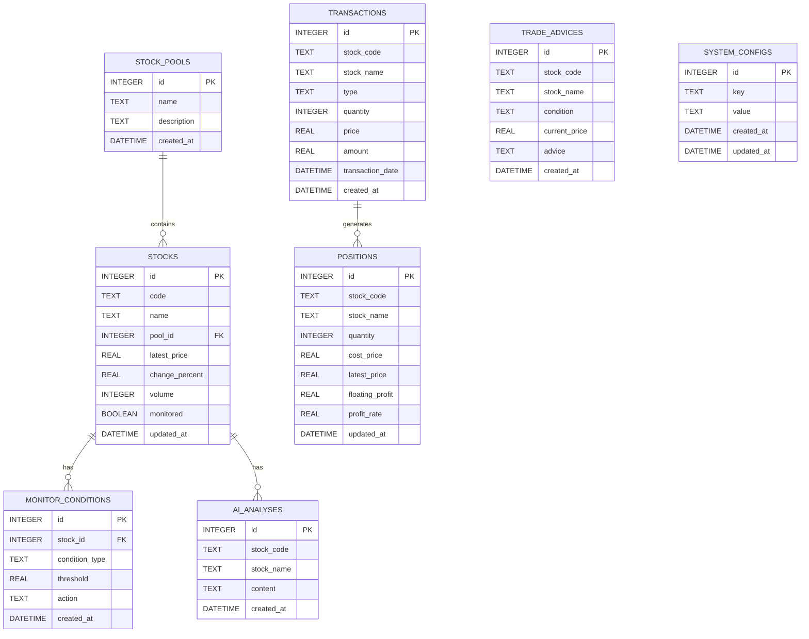

# 股票投资管理桌面应用 - 技术架构文档

**版本号**：V1.0  
**文档日期**：2026-05-15  
**技术栈**：Tauri 2.0 + React 18 + TypeScript + Vite + Ant Design + ECharts

---

## 1. 架构设计

### 1.1 整体架构



### 1.2 架构分层说明

| 层级 | 技术选型 | 说明 |
|------|---------|------|
| 前端 | React 18 + TypeScript + Vite 5 | 快速构建现代化前端应用 |
| 前端UI | Ant Design 5.x | 提供丰富的组件库，快速开发界面 |
| 图表 | ECharts 5.5.x | 绘制K线图、资产曲线、持仓分布饼图 |
| 状态管理 | Zustand 4.x | 轻量高效的前端状态管理 |
| 后端 | Rust 1.78+ + Tauri 2.0 | 高性能、内存安全的后端框架 |
| 数据库 | SQLite 3.45+ + sqlx 0.7 | 轻量嵌入式数据库，编译时类型检查 |
| 定时任务 | tokio-cron-scheduler 0.10 | 实现每日收盘后自动分析任务 |
| HTTP客户端 | reqwest 0.12 | 高性能异步HTTP客户端 |
| 加密 | aes-gcm 0.10 + argon2 0.5 | 加密存储API密钥和启动密码 |
| Excel处理 | calamine 0.24 | 读写Excel/CSV文件 |
| 打包工具 | Tauri CLI 2.0 | 一键生成Windows单文件可执行程序 |

---

## 2. 技术选型说明

### 2.1 为什么选择 Tauri 2.0

Tauri 2.0 是2026年桌面应用开发的工业级标准，完美匹配本项目所有需求：
- **极致轻量**：使用系统原生WebView，无需打包Chromium，最终安装包仅**8-12MB**
- **内存高效**：后台运行内存占用≤40MB，比Electron低70%以上
- **安全第一**：默认最小权限原则，严格的前后端隔离，Rust内存安全
- **全平台支持**：一键生成Windows/macOS/Linux安装包
- **生态成熟**：2026年企业级应用首选，文档完善，社区活跃
- **开发高效**：前端复用React/Vue生态，后端Rust处理高性能逻辑

### 2.2 前端技术栈

- **React 18**：组件化开发，Hooks状态管理
- **TypeScript**：类型安全，提升开发效率
- **Vite 5**：极速构建，热更新
- **Ant Design 5.x**：企业级UI组件库
- **ECharts 5.5.x**：专业数据可视化
- **Zustand 4.x**：轻量状态管理

### 2.3 后端技术栈

- **Rust 1.78+**：内存安全，高性能
- **Tauri 2.0**：桌面应用框架
- **sqlx 0.7**：异步SQL工具，编译时类型检查
- **tokio**：异步运行时
- **reqwest 0.12**：HTTP客户端
- **aes-gcm 0.10**：AES加密
- **argon2 0.5**：密码哈希
- **calamine 0.24**：Excel处理
- **tokio-cron-scheduler 0.10**：定时任务

---

## 3. 路由定义

### 3.1 前端路由

| 路由 | 页面名称 | 功能描述 |
|------|---------|---------|
| / | 首页/仪表盘 | 资产概览、今日提醒、快捷入口 |
| /pools | 股票池管理 | 股票池分组管理、股票列表 |
| /filter | 股票筛选 | 设置筛选条件、查看筛选结果 |
| /analysis | 智能分析 | 监控条件设置、交易建议报告 |
| /positions | 持仓管理 | 交易录入、持仓列表、盈亏统计 |
| /ai-analysis | AI分析 | 配置API密钥、生成/查看分析报告 |
| /settings | 系统设置 | 安全设置、数据管理、外观设置 |

### 3.2 IPC命令定义

```typescript
// 股票池管理
interface GetStockPoolsRequest {}
interface GetStockPoolsResponse {
  pools: StockPool[];
}

interface CreateStockPoolRequest {
  name: string;
  description?: string;
}

interface AddStockToPoolRequest {
  poolId: number;
  code: string;
  name: string;
}

// 股票筛选
interface FilterStocksRequest {
  conditions: FilterConditions;
}

interface FilterStocksResponse {
  stocks: Stock[];
}

// 持仓管理
interface AddTransactionRequest {
  stockCode: string;
  stockName: string;
  type: 'buy' | 'sell';
  quantity: number;
  price: number;
  transactionDate: string;
}

interface GetPositionsResponse {
  positions: Position[];
  totalMarketValue: number;
  totalFloatingProfit: number;
  totalAssets: number;
  totalReturnRate: number;
}

// AI分析
interface AnalyzeStockRequest {
  stockCode: string;
  stockName: string;
  modelType: 'doubao' | 'wenxin' | 'qianwen';
}

interface AnalyzeStockResponse {
  content: string;
}

// 系统设置
interface SetPasswordRequest {
  password: string;
}

interface SaveApiKeyRequest {
  modelType: string;
  apiKey: string;
}
```

---

## 4. 数据模型

### 4.1 ER图



### 4.2 数据库DDL

```sql
-- 股票池表
CREATE TABLE stock_pools (
    id INTEGER PRIMARY KEY AUTOINCREMENT,
    name TEXT NOT NULL,
    description TEXT,
    created_at DATETIME DEFAULT CURRENT_TIMESTAMP
);

-- 股票表
CREATE TABLE stocks (
    id INTEGER PRIMARY KEY AUTOINCREMENT,
    code TEXT NOT NULL,
    name TEXT NOT NULL,
    pool_id INTEGER NOT NULL,
    latest_price REAL,
    change_percent REAL,
    volume INTEGER,
    monitored BOOLEAN DEFAULT 1,
    updated_at DATETIME DEFAULT CURRENT_TIMESTAMP,
    FOREIGN KEY (pool_id) REFERENCES stock_pools(id) ON DELETE CASCADE
);

-- 监控条件表
CREATE TABLE monitor_conditions (
    id INTEGER PRIMARY KEY AUTOINCREMENT,
    stock_id INTEGER NOT NULL,
    condition_type TEXT NOT NULL,
    threshold REAL NOT NULL,
    action TEXT NOT NULL,
    created_at DATETIME DEFAULT CURRENT_TIMESTAMP,
    FOREIGN KEY (stock_id) REFERENCES stocks(id) ON DELETE CASCADE
);

-- 交易记录表
CREATE TABLE transactions (
    id INTEGER PRIMARY KEY AUTOINCREMENT,
    stock_code TEXT NOT NULL,
    stock_name TEXT NOT NULL,
    type TEXT NOT NULL,
    quantity INTEGER NOT NULL,
    price REAL NOT NULL,
    amount REAL NOT NULL,
    transaction_date DATETIME NOT NULL,
    created_at DATETIME DEFAULT CURRENT_TIMESTAMP
);

-- 持仓表
CREATE TABLE positions (
    id INTEGER PRIMARY KEY AUTOINCREMENT,
    stock_code TEXT NOT NULL UNIQUE,
    stock_name TEXT NOT NULL,
    quantity INTEGER NOT NULL,
    cost_price REAL NOT NULL,
    latest_price REAL,
    floating_profit REAL,
    profit_rate REAL,
    updated_at DATETIME DEFAULT CURRENT_TIMESTAMP
);

-- 交易建议表
CREATE TABLE trade_advices (
    id INTEGER PRIMARY KEY AUTOINCREMENT,
    stock_code TEXT NOT NULL,
    stock_name TEXT NOT NULL,
    condition TEXT NOT NULL,
    current_price REAL NOT NULL,
    advice TEXT NOT NULL,
    created_at DATETIME DEFAULT CURRENT_TIMESTAMP
);

-- AI分析报告表
CREATE TABLE ai_analyses (
    id INTEGER PRIMARY KEY AUTOINCREMENT,
    stock_code TEXT NOT NULL,
    stock_name TEXT NOT NULL,
    content TEXT NOT NULL,
    created_at DATETIME DEFAULT CURRENT_TIMESTAMP
);

-- 系统配置表
CREATE TABLE system_configs (
    id INTEGER PRIMARY KEY AUTOINCREMENT,
    key TEXT NOT NULL UNIQUE,
    value TEXT NOT NULL,
    created_at DATETIME DEFAULT CURRENT_TIMESTAMP,
    updated_at DATETIME DEFAULT CURRENT_TIMESTAMP
);

-- 创建索引
CREATE INDEX idx_stocks_pool_id ON stocks(pool_id);
CREATE INDEX idx_stocks_code ON stocks(code);
CREATE INDEX idx_monitor_conditions_stock_id ON monitor_conditions(stock_id);
CREATE INDEX idx_transactions_stock_code ON transactions(stock_code);
CREATE INDEX idx_transactions_date ON transactions(transaction_date);
CREATE INDEX idx_trade_advices_date ON trade_advices(created_at);
CREATE INDEX idx_ai_analyses_stock_code ON ai_analyses(stock_code);
```

---

## 5. Tauri 2.0 核心配置

### 5.1 权限配置

```json
{
  "tauri": {
    "permissions": [
      "core:default",
      "window:default",
      "notification:default",
      {
        "identifier": "fs:default",
        "allow": [{ "path": "$APPLOCALDATA/**" }]
      },
      {
        "identifier": "http:default",
        "allow": [
          "https://api.tushare.pro/*",
          "https://api.doubao.com/*",
          "https://aip.baidubce.com/*"
        ]
      }
    ],
    "security": {
      "csp": "default-src 'self'; script-src 'self' 'unsafe-inline'; style-src 'self' 'unsafe-inline'; img-src 'self' data:; connect-src 'self' https://api.tushare.pro https://api.doubao.com https://aip.baidubce.com"
    }
  }
}
```

### 5.2 IPC命令注册

```rust
fn main() {
    tauri::Builder::default()
        .invoke_handler(tauri::generate_handler![
            // 股票池管理
            get_stock_pools,
            create_stock_pool,
            update_stock_pool,
            delete_stock_pool,
            add_stock_to_pool,
            remove_stock_from_pool,
            get_stocks_in_pool,
            
            // 股票筛选
            filter_stocks,
            save_filter_conditions,
            get_filter_conditions,
            
            // 智能分析
            set_monitor_condition,
            get_monitor_conditions,
            delete_monitor_condition,
            get_trade_advices,
            get_trade_advice_history,
            
            // 持仓管理
            add_transaction,
            get_transactions,
            delete_transaction,
            get_positions,
            get_position_summary,
            
            // AI分析
            analyze_stock_with_ai,
            get_ai_analyses,
            save_api_key,
            get_api_key,
            
            // 系统设置
            set_password,
            verify_password,
            backup_database,
            restore_database,
            get_system_config,
            set_system_config
        ])
        .run(tauri::generate_context!())
        .expect("error while running tauri application");
}
```

---

## 6. 定时任务设计

### 6.1 每日收盘后分析任务

```rust
use tokio_cron_scheduler::{Job, JobScheduler};
use tauri::AppHandle;

fn setup_scheduler(app_handle: AppHandle) {
    tauri::async_runtime::spawn(async move {
        let mut scheduler = JobScheduler::new().await.unwrap();
        
        // 每日15:30执行收盘后分析任务
        let job = Job::new("0 30 15 * * *", move |_uuid, _l| {
            let app_handle = app_handle.clone();
            tauri::async_runtime::spawn(async move {
                // 1. 下载当日A股行情数据
                let market_data = match fetch_daily_astock_data().await {
                    Ok(data) => data,
                    Err(e) => {
                        eprintln!("Failed to fetch market data: {}", e);
                        return;
                    }
                };
                
                // 2. 更新股票池股票价格
                if let Err(e) = update_stock_prices(&market_data).await {
                    eprintln!("Failed to update stock prices: {}", e);
                    return;
                }
                
                // 3. 检查所有监控条件
                let triggered_stocks = match check_all_monitor_conditions(&market_data).await {
                    Ok(stocks) => stocks,
                    Err(e) => {
                        eprintln!("Failed to check monitor conditions: {}", e);
                        return;
                    }
                };
                
                // 4. 生成交易建议报告
                if !triggered_stocks.is_empty() {
                    if let Err(e) = generate_trade_advice_report(&triggered_stocks).await {
                        eprintln!("Failed to generate trade advice: {}", e);
                        return;
                    }
                    
                    // 5. 发送桌面通知
                    use tauri::api::notification::Notification;
                    Notification::new(&app_handle.config().identifier)
                        .title("股票交易提醒")
                        .body(&format!("今日有{}只股票触发交易条件", triggered_stocks.len()))
                        .show(&app_handle)
                        .unwrap();
                }
            });
        }).unwrap();
        
        scheduler.add(job).await.unwrap();
        scheduler.start().await.unwrap();
    });
}
```

---

## 7. 安全设计

### 7.1 数据加密

```rust
use aes_gcm::{Aes256Gcm, Key, Nonce};
use aes_gcm::aead::{Aead, NewAead};
use argon2::{Argon2, PasswordHash, PasswordHasher, PasswordVerifier};
use argon2::password_hash::SaltString;
use rand::rngs::OsRng;

// 加密API密钥
fn encrypt_api_key(plain_key: &str, master_key: &[u8]) -> Result<String, String> {
    let key = Key::<Aes256Gcm>::from_slice(master_key);
    let cipher = Aes256Gcm::new(key);
    let nonce = Nonce::from_slice(b"unique nonce"); // 实际应使用随机nonce
    
    let ciphertext = cipher.encrypt(nonce, plain_key.as_bytes())
        .map_err(|e| e.to_string())?;
    
    Ok(base64::encode(ciphertext))
}

// 验证启动密码
fn verify_password(password: &str, hash: &str) -> Result<bool, String> {
    let parsed_hash = PasswordHash::new(hash)
        .map_err(|e| e.to_string())?;
    
    Ok(Argon2::default().verify_password(password.as_bytes(), &parsed_hash).is_ok())
}
```

### 7.2 权限控制

- 前端无法直接访问文件系统，所有文件操作通过IPC命令
- 前端无法直接访问数据库，所有数据操作通过Rust后端
- HTTP请求仅限配置的API域名
- 文件系统访问仅限应用数据目录

---

## 8. 开发环境搭建

### 8.1 前置要求

1. 安装Rust工具链：
   ```bash
   curl --proto '=https' --tlsv1.2 -sSf https://sh.rustup.rs | sh
   ```
2. 安装Node.js 20+和pnpm
3. 安装Tauri CLI：
   ```bash
   cargo install tauri-cli
   ```

### 8.2 项目初始化

```bash
# 创建Tauri 2.0项目
pnpm create tauri-app@latest --template react-ts

# 安装前端依赖
pnpm install antd echarts zustand react-router-dom

# 安装开发依赖
pnpm install -D @types/node

# 启动开发服务器
pnpm tauri dev
```

### 8.3 打包部署

```bash
# 构建生产版本
pnpm tauri build

# 输出文件
# Windows单文件可执行程序：src-tauri/target/release/stock-investment-manager.exe
# Windows安装包：src-tauri/target/release/bundle/msi/*.msi
```

---

## 9. 项目结构

```
smps/
├── src/                          # 前端代码
│   ├── components/               # 公共组件
│   │   ├── Layout/               # 布局组件
│   │   ├── StockTable/           # 股票表格组件
│   │   ├── Chart/                # 图表组件
│   │   └── Modal/                # 弹窗组件
│   ├── pages/                    # 页面组件
│   │   ├── Dashboard/            # 首页/仪表盘
│   │   ├── StockPools/           # 股票池管理
│   │   ├── StockFilter/          # 股票筛选
│   │   ├── Analysis/             # 智能分析
│   │   ├── Positions/            # 持仓管理
│   │   ├── AIAnalysis/           # AI分析
│   │   └── Settings/             # 系统设置
│   ├── hooks/                    # 自定义Hooks
│   ├── stores/                   # Zustand状态管理
│   ├── utils/                    # 工具函数
│   ├── types/                    # TypeScript类型定义
│   ├── App.tsx                   # 根组件
│   └── main.tsx                  # 入口文件
├── src-tauri/                    # Tauri后端代码
│   ├── src/                      # Rust源代码
│   │   ├── main.rs               # 入口文件
│   │   ├── commands/             # IPC命令
│   │   ├── models/               # 数据模型
│   │   ├── services/             # 业务逻辑
│   │   ├── db/                   # 数据库操作
│   │   ├── api/                  # 外部API调用
│   │   ├── scheduler/            # 定时任务
│   │   └── crypto/               # 加密模块
│   ├── Cargo.toml                # Rust依赖
│   └── tauri.conf.json           # Tauri配置
├── .trae/documents/              # 项目文档
│   ├── prd.md                    # PRD文档
│   └── technical-architecture.md # 技术架构文档
├── package.json                  # Node.js依赖
├── vite.config.ts                # Vite配置
├── tsconfig.json                 # TypeScript配置
└── tailwind.config.js            # Tailwind配置
```

---

## 10. 风险与应对措施

| 风险点 | 影响程度 | 应对措施 |
|--------|---------|---------|
| 免费行情API不稳定 | 中 | 同时对接2-3个免费行情API，主API失败时自动切换备用API |
| 大模型API调用失败 | 中 | 添加错误处理和重试机制，给用户明确的失败提示 |
| 本地数据丢失 | 高 | 支持手动备份和恢复SQLite数据库功能 |
| 应用被杀毒软件误报 | 中 | 为可执行文件添加数字签名 |
| WebView兼容性问题 | 低 | 要求用户系统为Windows 10 1809+ |

---

## 11. 附录

### 11.1 参考文档

- [用户需求说明书](d:\sf-project\smps/需求说明书.md)
- [PRD产品需求文档](d:\sf-project\smps/.trae/documents/prd.md)
- [Tauri 2.0官方文档](https://tauri.app/)
- [Rust官方文档](https://www.rust-lang.org/)

### 11.2 术语定义

- **IPC**：进程间通信，前端与后端交互的方式
- **sqlx**：Rust异步SQL工具，支持编译时类型检查
- **tokio**：Rust异步运行时
- **reqwest**：Rust HTTP客户端
